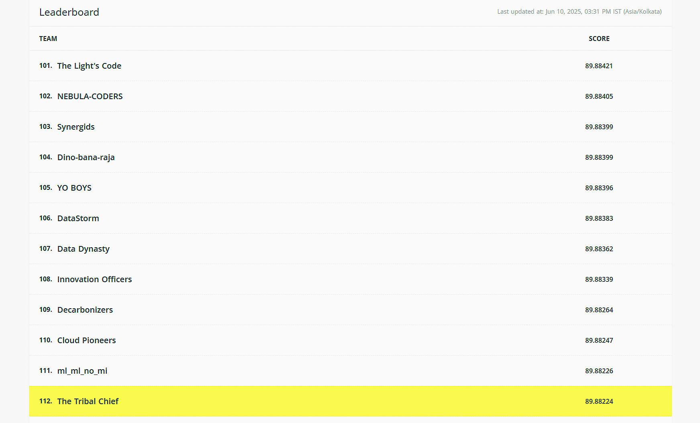

# 🌞 PREDICTIVE MAINTENANCE SYSTEM FOR SOLAR PANELS

## 🧠 Problem Statement

As solar energy systems become mainstream in sustainable infrastructure, it is critical to ensure panels operate at maximum efficiency. Traditional reactive maintenance results in energy loss and cost inefficiencies. This project focuses on developing a **Predictive ML Model** to forecast performance degradation and potential failures in solar panels based on environmental and sensor data.

---

## 🗂️ Dataset Description

The dataset contains the following files:

- `train.csv`: 20,000 samples, 17 features
- `test.csv`: 12,000 samples, 16 features

### 📌 Features:
| Column | Description |
|--------|-------------|
| id | Unique row identifier |
| temperature | Ambient air temperature (°C) |
| irradiance | Solar energy received per unit area (W/m²) |
| humidity | Moisture content in air (%) |
| panel_age | Age of the solar panel (years) |
| maintenance_count | Count of maintenance activities |
| soiling_ratio | Efficiency loss due to dirt (0–1) |
| voltage | Panel voltage output (V) |
| current | Panel current output (A) |
| module_temperature | Panel surface temperature (°C) |
| cloud_coverage | Sky coverage by clouds (%) |
| wind_speed | Wind speed (m/s) |
| pressure | Atmospheric pressure (hPa) |
| string_id | Panel group ID (A1, B2, etc.) |
| error_code | Diagnostic error code (E00, E01...) |
| installation_type | Mounting type: fixed/tracking/dual-axis |
| efficiency | 🎯 Target: energy output efficiency |

---

## ⚙️ Models Used

- 🔁 **Cross-validation:** `KFold`
- 🧪 **Evaluation metric:**  
  `Score = 100 × (1 - sqrt(MSE))`
- 🧠 **Algorithms:**
  - LightGBM
  - CatBoost
  - XGBoost
  - Ridge Regression
  - ExtraTreesRegressor
  - TabNet
- 🔍 **Hyperparameter Tuning:** Optuna
- 📊 **Explainability:** SHAP (SHapley Additive exPlanations)

---

## 🧪 Evaluation Metric

```python
score = 100 * (1 - np.sqrt(mean_squared_error(actual, predicted)))
```

The closer the score is to **100**, the better.

---

## 📈 Results

Ranked **#112** out of hundreds of teams with a score of **89.88224**

---

## 🏅 Rank Screenshot




